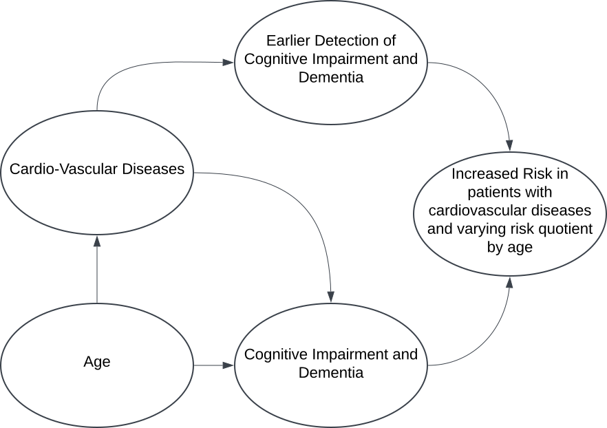

```{r setup, include=FALSE}
knitr::opts_chunk$set(echo = TRUE)
library(tidyverse)
library(visdat)
library(dplyr)
```

### Our Idea
was to investigate the effects and interactions between different diseases, especially between those affecting the physical and those affecting the cognitive wellbeing of an individual.
In order to do this we use a tidy-tuesday dataset (patient risk profiles) that "contains 100 simulated patient's medical history features and the predicted 1-year risk of 14 outcomes based on each patient's medical history features. The predictions used real logistic regression models developed on a large real world healthcare dataset."

### Limitations:
While this dataset brings the advantage of indirectly containing a lot of data, it only simulated 100 people. This means we are forced to rely, to some extent, on the previously done statistics, as the statistical power of 100 datapoints is limited. Another limitation, related to the first is that the values provided in the dataset are the results of the regression model the authors developed. Thus, we are bounded by their statistical regression model. Despite this, we believe these factors to be negligible; The dataset was published as a tidy-tuesday dataset, which indicates a reliability and quality sufficient for the scope of this project.

### Hypothesis:
We hypothesize that the presence of cardiovascular conditions is associated with an increased predicted risk of dementia across all age groups, with the magnitude of this association varying by age. Specifically, we expect that the relative risk of dementia for individuals with cardiovascular conditions compared to those without will peak in patients age 65-69 than in younger age groups.

The reasons for us to believe this hypothesis can be grouped into two clusters:
Firstly, there are reasons that suggest the generally elevated risk of dementia in patients with cardiovascular conditions.
Secondly, the varying relative risk is based on other assumptions.

#### Reasons for the general elevated risk of dementia in patients with cardiovascular conditions:

1. **Cardiovascular Conditions and Cerebral Health**
   + Cardiovascular conditions such as angina, atrial fibrillation, and coronary artery disease can impair blood flow to the brain, leading to vascular contributions to cognitive impairment and dementia. Reduced blood flow and microvascular damage to the brain could accelerate neurodegeneration.[See Neurovascular dysfunction and neurodegeneration in dementia and Alzheimer's disease]
   + Atrial fibrillation, in particular, increases the risk of stroke and microinfarcts in the brain, both of which are linked to an increased likelihood of developing dementia. [See Atrial Fibrillation, Cognitive Decline and Dementia]
2. **Cardiovascular Conditions at Higher Age, Third reason**
   + At ages 65-69, patients are more likely to experience the combined effects of aging and systemic diseases compared to younger groups, but they may not yet have the compensatory mechanisms seen in older populations who have "adapted" to chronic health changes. Furthermore, the unwillingness to acknowledge one-self aging might adversely affect the willingness to seek these adaptions.
   + This age group is often where early signs of dementia begin to appear. Cardiovascular conditions can act as triggers to or exacerbate the progression of this process.
   + Higher Age is both a risk factor for dementia and cardiovascular conditions.

#### Reasons for the varying relative risk of dementia in patients with cardiovascular conditions compared to those without:
1. **Earlier Onset of Vulnerability of Patients with Cardiovascular Conditions**
   + The presence of cardiovascular conditions may accelerate the onset of cognitive decline and dementia, leading to a more pronounced relative risk in younger age groups.
   + The protectory mechanisms that typically delay the onset of dementia in older populations may not be as effective in younger individuals with cardiovascular conditions, leading to a earlier rise in dementia risk.

2. **Shift in self health awareness**
    + Patients with diagnosed health conditions are more likely to have a heightened awareness of their health and seek medical attention when needed. This could lead to earlier detection of cognitive decline and dementia, especially in younger age groups, therefore leading to a higher relative risk of dementia in these groups.

#### General Relationships
1. **Aging and Cognitive Decline**
+ Aging is the primary risk factor for cognitive decline and dementia. The age group 65-69 falls into a critical period when many individuals begin to show early signs of cognitive impairment, which may develop into dementia. For example, the risk of Alzheimer's disease growths exponentially with age from less than 5% at 65 to 40% beyond the age of 85 [See The Impact of Age on Cognition]
+ Neurological  resilience diminishes with age, making the brain more vulnerable to damage from systemic conditions like cardiovascular diseases [See Aging leads to altered microglial function that reduces brain resiliency increasing vulnerability to neurodegenerative diseases].
+ Sleep quality decreases with growing age, which affects the glymphatic system. Lower glymphatic clearance may lead to proteine accumulation in the brain, which is associated with neurodegenerative diseases like Alzheimer's. [See Glymphatic failure as a final common pathway to dementia]


#### Presumed Causal Relationships:
{width=50%}

## Get the dataset and check the na values
```{r}
#tuesdata <- read.csv("./data/patient_risk_profiles.csv")
tuesdata <- readr::read_csv('https://raw.githubusercontent.com/rfordatascience/tidytuesday/main/data/2023/2023-10-24/patient_risk_profiles.csv')
```


#### Rename all the columns to increasing numbers to make it easier to visualize how much of the data is missing as opposed to what data is missing. That is, so the column names do not distract from the visualization.

```{r}
columns <- colnames(tuesdata) %>%
    set_names() %>%
    as_tibble() %>%
    mutate(column_number = row_number()) %>%
    pull(column_number)
visualization_df <- tuesdata %>%
    set_names(columns)
vis_miss(visualization_df, show_perc_col = FALSE)

present_percent <- visualization_df %>%
    summarise_all(~sum(!is.na(.))/n()) %>%
    gather() %>%
    pull(value) %>%
    first()
```
#### As can be seen also in the visualization above, `r present_percent*100`% of the data is present.

### Data Cleaning
The dataset contains `r ncol(tuesdata)` columns and `r nrow(tuesdata)` rows. We will focus on the columns related to age groups, cardiovascular conditions, and predicted dementia risk for this analysis. The following code snippet selects these columns and renames them for easier reference.
```{r}
data <- tuesdata %>%
  select(personId,
         starts_with("age group:"),
         Angina = `Angina events in prior year`,
         AF = `Atrial Fibrillation, incident in prior year`,
         CAD = `Coronary artery disease (CAD) in prior year`,
         HF = `Heart failure in prior year`,
         HVD = `Heart valve disorder in prior year`,
         Dementia_risk = `predicted risk of Dementia`,
  )
colnames(data) <- gsub(pattern = "age group:  ", replacement ="ag", colnames(data)) %>%
    gsub(pattern = " -  ", replacement ="_", colnames(data)) %>%
    gsub(pattern = " ", replacement ="", colnames(data)) %>%
    gsub(pattern = "ag5_9", replacement = "ag05_9", colnames(data))

data %>%
  select(ag0_4, Angina, AF, CAD, Dementia_risk) %>%
    head()


```

## Data Wrangling:
To improve the usability of the dataset and enable meaningful analysis,  a new variable, Cardio_Condition, was created, which indicates the presence of cardiovascular disease. This binary feature was derived from existing variables indicating certain conditions such as angina pectoris, atrial fibrillation, coronary artery disease, heart failure and valve heart disorder. In addition, the dataset was transformed so that each person could be assigned to a single corresponding age group, allowing for a more streamlined analysis. These transformations should facilitate the examination of age-specific trends in dementia risk and their potential association with cardiovascular health.

```{r}
cleaned_data <- data %>%
        mutate(Cardio_Condition = ifelse(
                Angina == 1 | AF == 1 | CAD == 1 | HF == 1 | HVD == 1, 1, 0)
        ) %>%
        pivot_longer(cols = starts_with("ag"), # make it appear longer
                     names_to = "Age_Group",
                     values_to = "Age_Group_Value") %>%
        filter(Age_Group_Value == 1) %>%
        select(-Age_Group_Value) %>%
        mutate(Age_Group = as.factor(Age_Group))
head(cleaned_data)
```
The data now contains the columns `r colnames(cleaned_data)` and `r nrow(cleaned_data)` rows from the initial `r ncol(tuesdata)` columns and `r nrow(tuesdata)` rows.

## Exploratory Data Analysis
The exploratory data analysis focuses on understanding the relationship between cardiovascular conditions and dementia risk across different age groups. The data is grouped by age and the presence or absence of cardiovascular conditions. For each group, the average predicted dementia risk is calculated, enabling comparisons between individuals with and without cardiovascular conditions, as well as among different age categories.

Bar plots visualize the average dementia risks for both groups, showing that individuals with cardiovascular conditions generally have higher predicted risks of dementia across most age groups. The relative difference in dementia risk between these groups is also calculated and visualized, highlighting age groups where cardiovascular conditions are associated with greater disparities in risk.

```{r}
avg_risk <- cleaned_data %>%
        group_by(Age_Group) %>%
        summarise(avg_risk = mean(Dementia_risk, na.rm = TRUE))

ggplot(avg_risk, aes(x = Age_Group, y = avg_risk, fill = Age_Group)) +
        geom_bar(stat = "identity") +
        labs(title = "Average Predicted Risk of Dementia by Age Group",
             x = "Age Group",
             y = "Average Predicted Risk of Dementia",
             fill = "Age Group")
```

We first explore the average predicted risk of dementia across different age groups. The bar plot above shows that the average predicted risk of dementia generally increases with age, which is consistent with existing research on the relationship between age and dementia risk. The plot also provides a baseline for comparing the dementia risk between individuals with and without cardiovascular conditions.

For the following analyses, we aggregate over the age groups to compare the dementia risk between individuals with and without cardiovascular conditions for a given age group. Additionally, we explore how many datapoints are available for each age group in total and how many of those have cardiovascular conditions.

```{r}
heart_people <- cleaned_data %>%
        filter(Cardio_Condition == 1) %>% # only the people with heart
        group_by(Age_Group) %>%
        summarise(with_heart = n(), Dementia_risk_heart = mean(Dementia_risk, na.rm = TRUE))

no_heart_people <- cleaned_data %>%
        filter(Cardio_Condition == 0) %>% # only the people without heart
        group_by(Age_Group) %>%
        summarise(without_heart = n(), Dementia_risk_no_heart = mean(Dementia_risk, na.rm = TRUE))

all_people <- no_heart_people %>%
        left_join(heart_people, by = "Age_Group") %>%
        mutate(Dementia_risk_diff = Dementia_risk_heart - Dementia_risk_no_heart) %>%
        mutate(amount = without_heart + with_heart) %>%
        select(Age_Group, Dementia_risk_heart, Dementia_risk_no_heart, with_heart, without_heart, Dementia_risk_diff, amount) %>%
        arrange(desc(Dementia_risk_diff))

head(all_people)
```
We find, that in the age group of particular interest (65-69) there is `r all_people$with_heart[all_people$Age_Group == "ag65_69"]` person with cardiovascular conditions and `r all_people$without_heart[all_people$Age_Group == "ag65_69"]` people without cardiovascular conditions. This is a very small sample size, which might limit the statistical power of the following analysis.

Next, we explore the relative difference in predicted dementia risk between individuals with and without cardiovascular conditions across the age groups. The bar plot below visualizes the average predicted dementia risk across the age groups for the two groups (with and without cardiovascular conditions).
```{r}

# plot both the avg dementia risk for people with and without heart conditions
ggplot(all_people, aes(x = Age_Group)) +
        geom_bar(aes(y = Dementia_risk_heart, fill = "With Heart"), stat = "identity") +
        geom_bar(aes(y = Dementia_risk_no_heart, fill = "Without Heart"), stat = "identity", width = 0.5) +
        labs(title = "Average Predicted Risk of Dementia by Age Group",
                x = "Age Group",
                y = "Average Predicted Risk of Dementia",
                fill = "Heart Condition")
```
Additionally, we fitted two exponential regression models that predict the dementia risk based on the age group for people with and without cardiovascular conditions.
The following plot visualizes the predicted dementia risk for both groups across the age groups, showing that people with cardiovascular conditions generally have higher predicted risks of dementia compared to those without.
```{r}
cardio <- cleaned_data %>%
        filter(Cardio_Condition == 1) %>%
        select(Age_Group, Dementia_risk)
no_cardio <- cleaned_data %>%
        filter(Cardio_Condition == 0) %>%
        select(Age_Group, Dementia_risk)

cardio_exp <- lm(log(Dementia_risk) ~ as.numeric(Age_Group), data = cardio)
no_cardio_exp <- lm(log(Dementia_risk) ~ as.numeric(Age_Group), data = no_cardio)

cardio$predicted_cardio <- exp(predict(cardio_exp, new_data = cardio))
no_cardio$predicted_non_cardio <- exp(predict(no_cardio_exp, new_data = no_cardio))

ggplot() +
        geom_point(data = cardio, aes(x = Age_Group, y = Dementia_risk, color = "With Cardiovascular Condition")) +
        geom_line(data = cardio, aes(x = as.numeric(Age_Group), y = predicted_cardio, color = "With Cardiovascular Condition")) +

        geom_point(data = no_cardio, aes(x = Age_Group, y = Dementia_risk, color = "Without Cardiovascular Condition")) +
        geom_line(data = no_cardio, aes(x = as.numeric(Age_Group), y = predicted_non_cardio, color = "Without Cardiovascular Condition")) +

        scale_color_manual(values = c("With Cardiovascular Condition" = "red", "Without Cardiovascular Condition" = "blue")) +

        labs(title = "Predicted Risk of Dementia by Age Group, with and without cardiovascular conditions",
             x = "Age Group",
             y = "Predicted Risk of Dementia",
             color = "Condition") +
        theme(legend.position = "bottom")
```
The plot shows consistently higher average predicted dementia risks for individuals with cardiovascular conditions compared to those without across all age groups. This trend suggests that the presence of cardiovascular conditions may be associated with an increased risk of dementia, regardless of age.
Furthermore, we can observe this higher risk to not be of a constant magnitude across the age groups. The relative difference in predicted dementia risk between individuals with and without cardiovascular conditions is calculated and visualized in the next plot.

A higher relative difference indicates a greater disparity in dementia risk between the two groups. The bar plot below visualizes the relative difference in predicted dementia risk across the age groups, highlighting where the presence of cardiovascular conditions is associated with a more pronounced increase in dementia risk.
For the age group 65-69, the relative difference in predicted dementia risk is `r all_people$Dementia_risk_diff[all_people$Age_Group == "ag65_69"]`. If our hypothesis is correct, this value should be higher than in other age groups. This, however, does not appear to be the case.
```{r}
relative_difference <- all_people %>%
        mutate(relative_diff = Dementia_risk_heart / Dementia_risk_no_heart) %>%
        arrange(desc(relative_diff))

ggplot(relative_difference, aes(x = Age_Group, y = relative_diff, fill = Age_Group)) +
        geom_bar(stat = "identity") +
        labs(title = "Relative Difference in Predicted Risk of Dementia by Age Group",
                x = "Age Group",
                y = "Relative Difference in Predicted Risk of Dementia",
                fill = "Age Group")
```

We can see that the relative difference in predicted dementia risk between individuals with and without cardiovascular conditions varies across the age groups. However, due to the small sample size, we do not know if this variation is statistically significant. The age group 65-69 does not show a particularly high relative difference compared to other age groups, which does not support our hypothesis. The age group 40-44 shows the highest relative difference, which might be due to the small sample size and the inherent variability in the data. This age group contains only `r all_people$with_heart[all_people$Age_Group == "ag40_44"]` person with and `r all_people$without_heart[all_people$Age_Group == "ag40_44"]` person without cardiovascular conditions. This small sample size might lead to a higher relative difference due to the inherent variability in the data.

Now, we explore the distribution of the predicted risk of dementia for people with and without cardiovascular conditions to gain further insights into the relationship between these factors. To do so, we first convert the age groups to numeric values to create a continuous scale for the x-axis. As the age groups are ordinal, we use the average age of each group for this conversion.
For the following plot, we use a density plot to visualize this distribution.

```{r}
age_number_data <- cleaned_data %>%
  select(Age_Group, Cardio_Condition, Dementia_risk) %>%
  mutate(Cardio_Condition = ifelse(Cardio_Condition == 1, "With CVC", "Without CVC"),
         # Convert the age group to the average age of that group slighly abusing the fact that the age groups
         # are sorted alphabetically which means that the factors are also sorted that than can be multiplied.
         Age_Group_number = as.numeric(Age_Group)*5 - 3)

ggplot(age_number_data, aes(x = Dementia_risk, fill = Cardio_Condition)) +
  geom_density(alpha = 0.5) +
  labs(title = "Distribution of the risk of dementia for people with and without cardiovascular conditions",
       x = "Predicted Risk of Dementia",
       y = "Density",
       fill = "Presence of Cardiovascular Conditions")+
  theme(legend.position = "bottom")
```

The plot shows that there is a tendency for the peaks at higher dementia risk to belong to the group with cardiovascular conditions.
This might suggest that the presence of cardiovascular conditions increases the risk of dementia. However, it remains
unknown if this is a causal relationship or if other factors are at play. Namely, that those with cardiovascular conditions
are also older and that age is a significant factor in the risk of dementia. That would be a spurious correlation, because both the probability for cardiovascular conditions, and the risk of dementia increases with age. We explore this relationship further next.
```{r}
ggplot(age_number_data, aes(x = Age_Group_number, fill = Cardio_Condition)) +
        geom_density(alpha = 0.5) +
        labs(title = "Distribution of the age of people with and without cardiovascular conditions",
                x = "Age (years)",
                y = "Density",
                fill = "Presence of Cardiovascular Conditions") +
        theme(legend.position = "bottom")
```


The above plot showcases the age distributions grouped by the presence of cardiovascular conditions and showcases
that the distributions do not differ too much from each other. There is, however, a slightly higher shift towards the older
age groups in the group with cardiovascular conditions.

## Hypothesis Testing

### First part of the hypothesis:
To test the hypothesis that the presence of cardiovascular conditions is associated with an increased predicted risk of dementia across all age groups, we perform the following statistical analysis:

1. Subset the Data
2. Perform a Two-Sample t-Test
3. Interpret the Results

#### Subset the Data
Separate it into two groups:
+ Patients with cardiovascular conditions.
+ Patients without cardiovascular conditions.

```{r}
subset_with_heart <- cleaned_data %>%
  filter(Cardio_Condition == 1)

subset_without_heart <- cleaned_data %>%
    filter(Cardio_Condition == 0)

```

#### Perform a Two-Sample t-Test
We compare the mean predicted dementia risk between the two groups using a two-sample t-test. The null hypothesis (H₀) is that the means are equal, and the alternative hypothesis (H₁) is that the mean for the group with cardiovascular conditions is higher. We also need to account for the unequal age distribution in the two groups. As a lower age is associated with a lower risk of dementia.

```{r}
dementiarisk_with_heart <- subset_with_heart$Dementia_risk
dementiarisk_without_heart <- subset_without_heart$Dementia_risk
t_test_result <- t.test(
  dementiarisk_with_heart,
  dementiarisk_without_heart,
  alternative = "greater",
  var.equal = FALSE
)
p_value_heart <- t_test_result$p.value
t_test_result

```
If the p-value is less than 0.05, we reject the null hypothesis and conclude that the presence of cardiovascular conditions is associated with an increased predicted risk of dementia. Otherwise, we fail to reject the null hypothesis.

Our p-value is `r p_value_heart`. Therefore, we are unable to reject the null hypothesis. This suggests that there is no statistically significant difference in the predicted risk of dementia between patients with and without cardiovascular conditions, given the data we have.


### Second part of the hypothesis:
To test the hypothesis that patients aged 65-69 with prior cardiovascular conditions have a higher predicted risk of dementia compared to other age groups with similar conditions, we perform the following statistical analysis:

1. Subset the Data

Filter the data to include only rows where cardiovascular conditions are present and separate it into two groups:

   + Patients aged 65-69.
   + Patients in other age groups.
```{r}
subset_65_69 <- cleaned_data %>%
  filter(Age_Group == "ag65_69", Cardio_Condition == 1)

subset_others <- cleaned_data %>%
  filter(Age_Group != "ag65_69", Cardio_Condition == 1)
```

2. Perform a Two-Sample t-Test
We compare the mean predicted dementia risk between the two groups using a two-sample t-test. The null hypothesis (H₀) is that the means are equal, and the alternative hypothesis (H₁) is that the mean for the 65-69 age group is higher.

```{r}
dementiarisk_65_69 <- data.frame(
  Dementia_risk = c(subset_65_69$Dementia_risk, subset_65_69$Dementia_risk)) # as the data is too small
dementiarisk_others <- subset_others$Dementia_risk
t_test_result <- t.test(
  dementiarisk_65_69,
  dementiarisk_others,
  alternative = "greater",
  var.equal = FALSE
)
t_test_result
p_value <- t_test_result$p.value
```
If the p-value is less than 0.05, we reject the null hypothesis and conclude that patients aged 65-69 with prior cardiovascular conditions have a higher predicted risk of dementia compared to other age groups with similar conditions. Otherwise, we fail to reject the null hypothesis.

Our p-value is `r p_value`. Therefore, we fail to reject the null hypothesis. This suggests that there is no statistically significant difference in the predicted risk of dementia between patients aged 65-69 with prior cardiovascular conditions and patients in other age groups with similar conditions, given the data we have.

## Results
The analysis aimed to examine the relationship between cardiovascular conditions and dementia risk across age groups. However, it is crucial to note that the hypothesis test relied on a very limited dataset with only one data point (which was duplicated for the second part of the hypothesis), severely limiting the statistical power and reliability of the results. Key findings include:

1.	Average Predicted Risk:
   + Patients with cardiovascular conditions seem to generally exhibited a higher predicted risk of dementia than those without such conditions across all age groups, when looking at the graphs. The hypothesis test did not confirm this, as indicated by a p-value of `r p_value_heart` (greater than 0.05).
   + Additionally, the age group 65-69 showed no statistically significant difference in dementia risk compared to other age groups with similar cardiovascular conditions, as indicated by a p-value of `r p_value` (greater than 0.05).

2. Relative Risk Differences:

   + The relative difference in predicted dementia risk between individuals with and without cardiovascular conditions varied across age groups, with the highest relative difference observed in the age group 40-44. This variation could be due to the small sample size and inherent variability in the data.

   + While the age group 65-69 had a marginally higher average dementia risk, than its neighboring age groups, the differences were not significant enough to confirm a unique vulnerability compared to other groups.

3.	Visualization Insights:

   + The bar plots and density distributions highlighted variations in predicted dementia risks across age groups, with a trend of increased risk in older age groups.

   + The increase in dementia risk when cardiovascular conditions were present seems to be more pronounced in younger age groups. This could be due to the fact that without any cardiovascular conditions, the risk of dementia is generally lower in younger age groups, making the relative increase more noticeable. Or it could be due to the small sample size and inherent variability in the data.

## Conclusion

The analysis did not support either hypothesis, likely due to dataset limitations. The small sample size of 100 patients and the uneven distribution of patients across age groups limited the statistical power and generalizability of the results. The analysis provided some insights into the relationship between cardiovascular conditions and dementia risk but could not draw definitive conclusions. The observed trends suggest potential relationships worth exploring in a larger and more diverse dataset.

## Next Steps

   1. Increase Sample Size: Obtain a larger dataset with more diverse and real-world patient records to perform a statistically valid analysis.
   2. Refine Data: Ensure age groups and conditions are sufficiently represented to support meaningful subgroup comparisons.

## Sources:
1. Alonso A, Arenas de Larriva AP. Atrial Fibrillation, Cognitive Decline And Dementia. Eur Cardiol. 2016 Summer;11(1):49-53. doi: 10.15420/ecr.2016:13:2. PMID: 27547248; PMCID: PMC4988519.
2. Bickford PC, Flowers A, Grimmig B. Aging leads to altered microglial function that reduces brain resiliency increasing vulnerability to neurodegenerative diseases. Exp Gerontol. 2017 Aug;94:4-8. doi: 10.1016/j.exger.2017.01.027. Epub 2017 Feb 2. PMID: 28163132; PMCID: PMC5469713.
3. Murman DL. The Impact of Age on Cognition. Semin Hear. 2015 Aug;36(3):111-21. doi: 10.1055/s-0035-1555115. PMID: 27516712; PMCID: PMC4906299.
4. Nelson AR, Sweeney MD, Sagare AP, Zlokovic BV. Neurovascular dysfunction and neurodegeneration in dementia and Alzheimer's disease. Biochim Biophys Acta. 2016 May;1862(5):887-900. doi: 10.1016/j.bbadis.2015.12.016. Epub 2015 Dec 17. PMID: 26705676; PMCID: PMC4821735.
