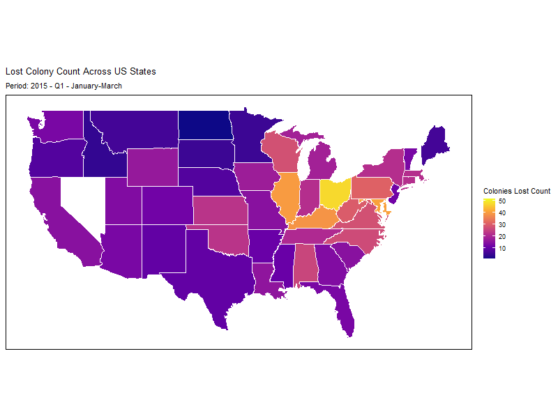
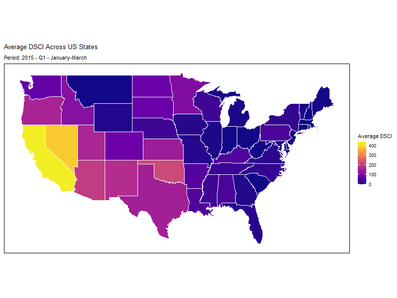

```{r setup, include=FALSE}

knitr::opts_chunk$set(echo = TRUE,
                      warning = FALSE,
                      message = FALSE)

options(scipen = 15)


```


```{r load-wrangle-data, echo = FALSE}
if (!require("tidyverse")) {
  install.packages("tidyverse")
}

library(tidyverse)

drought_path <- "./data/drought/"
bee_path <- "./data/bee/"

is_folder_empty <- function(folder) {
  length(list.files(folder, recursive = TRUE)) == 0
}

if (is_folder_empty(drought_path)) {
  drought_url <- "https://raw.githubusercontent.com/rfordatascience/tidytuesday/main/data/2022/2022-06-14/drought.csv"
  drought_fips_url <- "https://raw.githubusercontent.com/rfordatascience/tidytuesday/main/data/2022/2022-06-14/drought-fips.csv"
  
  download.file(drought_url, destfile = paste0(drought_path, "drought.csv"))
  download.file(drought_fips_url, destfile = paste0(drought_path, "drought-fips.csv"))
}

if (is_folder_empty(bee_path)) {
  colony_url <- "https://raw.githubusercontent.com/rfordatascience/tidytuesday/main/data/2022/2022-01-11/colony.csv"
  stressor_url <- "https://raw.githubusercontent.com/rfordatascience/tidytuesday/main/data/2022/2022-01-11/stressor.csv"
  
  download.file(colony_url, destfile = paste0(bee_path, "colony.csv"))
  download.file(stressor_url, destfile = paste0(bee_path, "stressor.csv"))
}

# Load the datasets
drought <- read_csv(paste0(drought_path, "drought.csv"))
drought_fips <- read_csv(paste0(drought_path, "drought-fips.csv"))
colony <- read_csv(paste0(bee_path, "colony.csv"))
stressor <- read_csv(paste0(bee_path, "stressor.csv"))
```

# Introduction
Bees are essential for maintaining ecosystems and supporting the health of the biosphere through their role in pollination. Bees are key pollinators for many fruits, vegetables, nuts, and seeds. Approximately one-third of the human food supply depends on insect pollination, predominantly by bees [@syngenta2021]. This underscores why the European honey bee is considered the most economically important pollinator for agricultural crops worldwide [@LeConte2008].<br>
<br>
In recent years, however, bee mortality and the decline of bee colonies have raised serious concerns. This alarming trend is driven by a variety of factors, with climate change emerging as a significant threat. Climate change introduces multiple stressors, including rising temperatures and an increasing frequency of droughts [@rankin2020].<br>
<br>
To better understand the impact of climate change on bee populations, it is crucial to examine the relationship between environmental stressors and bee mortality rates. Among these stressors, droughts may play a significant role due to their potential direct and indirect impacts on floral resources and habitat availability. In the following sections, the data is presented and analyzed to explore the connection between droughts and bee mortality.<br>
<br>

# Data Overview  

## Understanding the Drought Dataset  
This section delves into the characteristics of the drought data, including its sources, key variables, and temporal coverage.<br>  
The dataset is sourced from the [TidyTuesday repository](https://github.com/rfordatascience/tidytuesday/tree/main/data/2022/2022-06-14) and was originally compiled by the National Integrated Drought Information System (NIDIS).<br>  

### Dataset Structure  
The drought data consists of two related datasets:  
1. **`drought.csv`**: State-level data on drought and wetness conditions over time.<br>
2. **`drought_fips.csv`**: County-level data on drought conditions using FIPS codes for localized analysis. <br>

These datasets provide detailed information on drought frequency and intensity across different regions and time periods within the United States. The data points are taken daily over a span from the year 1895 to the present. <br>

### Insights in the **`drought.csv`** dataset:
Key variables include `DATE`, which records the date of observation, and severity levels such as `D0` (abnormally dry), `D1` (moderate drought), `D2` (severe drought), `D3` (extreme drought), and `D4` (exceptional drought). Similarly, `W0` to `W4` track wetness levels. with `W0` representing the least wet conditions and `W4` indicating the wettest conditions. The `state` variable indicates the location.<br>

To provide a closer look, the following table shows a preview of the data:
```{r glimpse-of-data, echo = FALSE}
if (!require("knitr")) {
  install.packages("knitr", dependencies = TRUE)
}
if (!require("kableExtra")) {
  install.packages("kableExtra", dependencies = TRUE)
}

library(knitr)
library(kableExtra)

# Select interesting rows
selected_rows <- drought[1000:1010, ]

# Display rows as table
selected_rows %>% 
  kable(caption = "Preview of the drought dataset (`drought.csv`)") %>%
  kable_styling("striped", full_width = FALSE) %>%
  row_spec(4, background = "#FFFFCC")
```

We can see that, for example, in the <span style="background-color: #FFFFCC;">fourth row</span> of the table, Alabama experienced significant drought conditions on July 1, 1978. On this date, 34.1% of the state was categorized as abnormally dry (`D0`), 18.9% as moderate drought (`D1`), and 2.5% as severe drought (`D2`). No areas were recorded under extreme drought (`D3`) or exceptional drought (`D4`).

On the wetness side, 25.0% of the state was under least wet conditions (`W0`), 21.0% under moderately wet conditions (`W1`), 9.5% under very wet conditions (`W2`), and 3.6% under extremely wet conditions (`W3`). A small portion (1.5%) of the state fell into the wettest conditions (`W4`) category, indicating the highest levels of wetness during this time.

The attentive reader may have noticed the inclusion of the `0` and `-9` columns in the dataset. These columns serve an important purpose in interpreting the data. The `0` column indicates the total percentage of the state experiencing any form of drought conditions. For example, in this case, it shows 41.0% for Alabama on July 1, 1978, representing the combined percentage of the state categorized under `D0` through `D4`.

On the other hand, the `-9` column captures the percentage of the state for which no data was available. This could include regions not monitored or excluded from the analysis. For this particular date and location, the `-9` value is 0%, meaning that complete data was recorded for Alabama.<br>
<br>

### Insights in the **`drought_fips.csv`** dataset:
In addition to the main drought dataset, **`drought.csv`**, the **`drought_fips.csv`** dataset provides detailed information on drought conditions categorized by the Federal Information Processing Standards (FIPS) code, a unique identifier for geographical regions within the United States. This additional data allows for a more granular analysis of drought conditions at the county or region level, helping to track localized drought trends over time.

To illustrate this further, the following table shows a preview of the **`drought_fips.csv`** dataset:
```{r glimpse-of-fips-data, echo = FALSE}
library(knitr)
library(kableExtra)

# Select interesting rows
selected_rows <- drought_fips[36660:36665, ]

# Display rows as table
selected_rows %>% 
  kable(caption = "Preview of the drought-fips dataset (`drought_fips.csv`)") %>%
  kable_styling("striped", full_width = FALSE) %>%
  row_spec(2, background = "#FFFFCC")
```

For instance, looking at the <span style="background-color: #FFFFCC;">second row</span> of the table, the `FIPS` code 01003 corresponds to Baldwin County in Alabama, as confirmed by the `state` column showing AL. The DSCI (Drought Severity and Coverage Index) is a measure used to assess the severity and extent of drought conditions, with values ranging from 0 (no drought) to 500 (extreme drought). On November 21, 2006, the DSCI value for Baldwin County is recorded as 87, indicating a moderately severe drought in this area. <br>

## Understanding the Bee Mortality Dataset  
This section explores the characteristics of the bee mortality dataset, including its sources, key variables, and structure.<br>  
The dataset is sourced from the [TidyTuesday repository](https://github.com/rfordatascience/tidytuesday/blob/main/data/2022/2022-01-11/readme.md) and provides insights into colony losses and stressors affecting honeybee populations across the United States over time.<br>

### Dataset Structure  
The bee mortality data consists of two related datasets:  
1. **`colony.csv`**: Contains data on the number of bee colonies, their losses, and related statistics.  
2. **`stressor.csv`**: Focuses on stressors affecting the colonies, including pests, diseases, and environmental factors.<br>

Both datasets covers data from 2015 to 2021, with all U.S. states included.<br>

### Insights in the **`colony.csv`** dataset:  
The **`colony.csv`** dataset contains several key variables that provide detailed insights into bee colony dynamics over time. The `year` variable indicates the year of observation, while months specifies the time period within the year, such as January to March. The `state` variable identifies the U.S. state being observed, allowing for geographic analysis of bee colonies.<br>
<br>
Data on colony numbers is captured in several fields: `colony_n` records the number of colonies at the start of the period, and `colony_max` represents the maximum number of colonies during the same timeframe. The dataset also tracks losses and additions to colonies, with `colony_lost` detailing the number of colonies lost and `colony_lost_pct` expressing this loss as a percentage. Similarly, `colony_added` reflects the number of colonies added during the period.<br>
<br>
Efforts to improve or maintain colonies are represented by `colony_reno`, which shows the number of colonies renovated, and `colony_reno_pct`, which provides the percentage of colonies that underwent renovation.<br>

To better understand the data, the following table provides a preview of the `colony.csv` dataset:  
```{r glimpse-of-colony-data, echo = FALSE}
library(knitr)
library(kableExtra)

# Example rows from colony.csv
colony_example <- data.frame(
  year = c(2015, 2015, 2015, 2015, 2015, 2015),
  months = c("January-March", "January-March", "January-March", "January-March", "January-March", "January-March"),
  state = c("Alabama", "Arizona", "Arkansas", "California", "Colorado", "Connecticut"),
  colony_n = c(7000, 35000, 13000, 1440000, 3500, 3900),
  colony_max = c(7000, 35000, 14000, 1690000, 12500, 3900),
  colony_lost = c(1800, 4600, 1500, 255000, 1500, 870),
  colony_lost_pct = c(26, 13, 11, 15, 12, 22),
  colony_added = c(2800, 3400, 1200, 250000, 200, 290),
  colony_reno = c(250, 2100, 90, 124000, 140, NA),
  colony_reno_pct = c(4, 6, 1, 7, 1, NA)
)

# Display table
colony_example %>%
  kable(caption = "Preview of the bee mortality dataset (`colony.csv`)") %>%
  kable_styling("striped", full_width = FALSE) %>%
  row_spec(3, background = "#FFFFCC")
```

In the <span style="background-color: #FFFFCC;">third row</span> of the table, the data pertains to Arkansas during the period of January–March 2015. The `colony_n` value shows that the state started with 13,000 colonies, which increased to a maximum of 14,000 (`colony_max`). However, 1,500 colonies were lost during this time (`colony_lost`), accounting for an 11% loss (`colony_lost_pct`). Arkansas added 1,200 colonies (`colony_added`) and renovated 90 colonies (`colony_reno`), representing 1% of colonies renovated (`colony_reno_pct`).

### Insights in the **`stressor.csv`** dataset:
The **`stressor.csv`** dataset captures key information about the factors affecting bee colonies across the United States. It includes the variable `year`, representing the year of observation, and the variable `months`, specifying the time period within that year. Observations are categorized by `state`, providing insights into regional differences in the challenges faced by bee populations. The dataset also identifies specific `stressor` types, such as Varroa mites or pesticides, and quantifies their impact through the `stress_pct` variable, which represents the percentage of colonies affected.<br>

The following table provides a preview of the **`stressor.csv`** dataset:
```{r glimpse-of-stressor-data, echo = FALSE}
# Example rows from stressor.csv
stressor_example <- data.frame(
  year = c(2015, 2015, 2015, 2015, 2015, 2015),
  months = c("January-March", "January-March", "January-March", "January-March", "January-March", "January-March"),
  state = c("Alabama", "Alabama", "Alabama", "Alabama", "Alabama", "Alabama"),
  stressor = c("Varroa mites", "Other pests/parasites", "Diseases", "Pesticides", "Other", "Unknown"),
  stress_pct = c(10.0, 5.4, NA, 2.2, 9.1, 9.4)
)

# Display table
stressor_example %>%
  kable(caption = "Preview of the stressor dataset (`stressor.csv`)") %>%
  kable_styling("striped", full_width = FALSE) %>%
  row_spec(1, background = "#FFFFCC")
```

In the <span style="background-color: #FFFFCC;">first row</span> of the table, the data pertains to Alabama during January–March 2015. The stressor is "Varroa mites," which impacted 10.0% (stress_pct) of the bee colonies during this time. Varroa mites are a significant stressor known to harm bee health and contribute to colony losses.


# Our Hypothesis
Drought conditions negatively impact the availability of forage resources, such as flowers, for bees, thereby reducing their food supply and increasing stress on bee populations. As a result, we expect that areas experiencing more severe drought conditions (as indicated by higher DSCI values) will show higher percentages of stressed colonies or even lost colonies.<br>
<br>
However, this expected correlation is also influenced by the region and season. In some regions, the impact of drought on bee colonies will be more severe due to factors like local climate, typical drought frequency, and forage availability.<br>

## Important variables
To test our hypothesis, we rely on several key variables from the datasets:<br>

- `D0` - `D4` and `W0` - `W4`: From the **`drought.csv`** dataset<br>
These variables represent drought severity (`D0` to `D4`) and wetness levels (`W0` to `W4`), which allow us to assess the impact of drought and moisture conditions on bee health.

- `colony_lost`: From the **`colony.csv`** dataset<br>
This variable indicates the number of colonies lost during a given period, which is crucial for understanding the relationship between drought conditions and colony stress.

- `stress_pct`: From the **`stressor.csv`** dataset<br>
This variable shows the percentage of colonies affected by various stressors, such as drought or pests, helping us measure the stress on bee populations.

- `state` and `date`/`months`/`year`: From both the **`drought.csv`** and **`stressor.csv`** datasets<br>
These variables provide important regional and temporal context, enabling us to explore seasonal and regional variations in drought impact on bee colonies.

# Preprocessing
In this chapter, we focus on preparing the datasets introduced in Chapter [Data Overview](# Data Overview) for subsequent analysis.<br>
First, variables are standardized to ensure consistent naming conventions and formats. Next, the data is filtered to align with the common time period. Following this, relevant datasets are merged and finally, any missing data is addressed.<br>

## Standardizing Variable Names and Formats
The  **`drought.csv`** dataset initially stored dates in a single variable, formatted as `d_year|month|day` while the  **`drought_fips.csv`** dataset stores year,  month and day as separate variables. Therefore this format was restructured into three separate variables: `year`, `month`, and `day`. <br>
<br>
Here is a glimpse of the transformed **`drought.csv`** dataset: <br>

```{r change-drought-DATE, echo = FALSE}
library(dplyr)

# Convert data into year, month and day
drought <- drought %>%
  mutate(
    # Remove 'd_' from DATE
    cleaned_date = gsub("d_", "", DATE),
    
    # Get the year
    year = substr(cleaned_date, 1, 4),
    
    # Get month by name
    month = case_when(
      substr(cleaned_date, 5, 6) == "01" ~ "January",
      substr(cleaned_date, 5, 6) == "02" ~ "February",
      substr(cleaned_date, 5, 6) == "03" ~ "March",
      substr(cleaned_date, 5, 6) == "04" ~ "April",
      substr(cleaned_date, 5, 6) == "05" ~ "May",
      substr(cleaned_date, 5, 6) == "06" ~ "June",
      substr(cleaned_date, 5, 6) == "07" ~ "July",
      substr(cleaned_date, 5, 6) == "08" ~ "August",
      substr(cleaned_date, 5, 6) == "09" ~ "September",
      substr(cleaned_date, 5, 6) == "10" ~ "October",
      substr(cleaned_date, 5, 6) == "11" ~ "November",
      substr(cleaned_date, 5, 6) == "12" ~ "December",
      TRUE ~ NA_character_
    ),
    
    # Get day
    day = substr(cleaned_date, 7, 8)
  ) %>%
  select(-cleaned_date) # Don't show cleaned_date
```

```{r glimpse-transformed-drought, echo = FALSE}

# Glimpse the first row of the new drought dataset
drought %>%
  head(1) %>%  # Select the first 5 rows
  kable(caption = "Preview of the transformed drought dataset") %>%
  kable_styling("striped", full_width = FALSE)
```

In the drought_fips dataset, months are represented numerically, and state names are abbreviated. To ensure consistency, the data has been transformed to use full month names and state names written in full.<br>
Below is a preview of the transformed dataset:<br>

```{r change-drought-fips-date, echo = FALSE}
drought_fips <- drought_fips %>%
  mutate(
    
    # Get the year
    year = substr(date, 1, 4),
    
    # Get month by name
    month = case_when(
      substr(date, 6, 7) == "01" ~ "January",
      substr(date, 6, 7) == "02" ~ "February",
      substr(date, 6, 7) == "03" ~ "March",
      substr(date, 6, 7) == "04" ~ "April",
      substr(date, 6, 7) == "05" ~ "May",
      substr(date, 6, 7) == "06" ~ "June",
      substr(date, 6, 7) == "07" ~ "July",
      substr(date, 6, 7) == "08" ~ "August",
      substr(date, 6, 7) == "09" ~ "September",
      substr(date, 6, 7) == "10" ~ "October",
      substr(date, 6, 7) == "11" ~ "November",
      substr(date, 6, 7) == "12" ~ "December",
      TRUE ~ NA_character_
    ),
    state_full = case_when(
      State == "AL" ~ "alabama",
      State == "AK" ~ "alaska",
      State == "AZ" ~ "arizona",
      State == "AR" ~ "arkansas",
      State == "CA" ~ "california",
      State == "CO" ~ "colorado",
      State == "CT" ~ "connecticut",
      State == "DE" ~ "delaware",
      State == "FL" ~ "florida",
      State == "GA" ~ "georgia",
      State == "HI" ~ "hawaii",
      State == "ID" ~ "idaho",
      State == "IL" ~ "illinois",
      State == "IN" ~ "indiana",
      State == "IA" ~ "iowa",
      State == "KS" ~ "kansas",
      State == "KY" ~ "kentucky",
      State == "LA" ~ "louisiana",
      State == "ME" ~ "maine",
      State == "MD" ~ "maryland",
      State == "MA" ~ "massachusetts",
      State == "MI" ~ "michigan",
      State == "MN" ~ "minnesota",
      State == "MS" ~ "mississippi",
      State == "MO" ~ "missouri",
      State == "MT" ~ "montana",
      State == "NE" ~ "nebraska",
      State == "NV" ~ "nevada",
      State == "NH" ~ "new hampshire",
      State == "NJ" ~ "new jersey",
      State == "NM" ~ "new mexico",
      State == "NY" ~ "new york",
      State == "NC" ~ "north carolina",
      State == "ND" ~ "north dakota",
      State == "OH" ~ "ohio",
      State == "OK" ~ "oklahoma",
      State == "OR" ~ "oregon",
      State == "PA" ~ "pennsylvania",
      State == "RI" ~ "rhode island",
      State == "SC" ~ "south carolina",
      State == "SD" ~ "south dakota",
      State == "TN" ~ "tennessee",
      State == "TX" ~ "texas",
      State == "UT" ~ "utah",
      State == "VT" ~ "vermont",
      State == "VA" ~ "virginia",
      State == "WA" ~ "washington",
      State == "WV" ~ "west virginia",
      State == "WI" ~ "wisconsin",
      State == "WY" ~ "wyoming",
      TRUE ~ NA_character_
    ),
    # Get day
    day = substr(date, 9, 10)
  ) %>%
  rename(state = state_full) %>%
  select(state, FIPS, DSCI, year, month, day)
```

```{r glimpse-transformed-drought-fips, echo = FALSE}

# Glimpse the first row of the new drought dataset
drought_fips %>%
  head(1) %>%
  kable(caption = "Preview of the transformed drought dataset") %>%
  kable_styling("striped", full_width = FALSE)
```

Now, all shared variables across the **`drought.csv`**, **`drought_fips.csv`**, and **`colony.csv`** datasets have been standardized to follow a consistent naming convention and format. This standardization ensures compatibility, allowing the datasets to be merged seamlessly for comprehensive analysis. 

## Connecting Datasets: Temporal Overlap  
To ensure the datasets are compatible for analysis, it is important to align their time periods. The **`colony.csv`** dataset spans the years 2015 to 2021, while the **`drought.csv`** and **`drought_fips.csv`** datasets cover a broader time range.<br>
This filtering step ensures that all observations align temporally, therefore removing all data outside this 2015 to 2021 range. <br>

```{r remove-drought-data-based-on-date, echo = FALSE}

# get copy of original drought data for before and after
drought_original <-drought

drought <- drought %>%
   filter(year >= 2015 & (year < 2021 | (year == 2021 & month <= "June")))
```

```{r remove-drought-fips-data-based-on-date, echo = FALSE}

# get copy of original drought data for before and after
drought_fips_original <-drought_fips

drought_fips <- drought_fips %>%
   filter(year >= 2015 & (year < 2021 | (year == 2021 & month <= "June")))
```

```{r compare-before-and-after-temporal-filtering, echo = FALSE}

# Summarize data before and after filtering
drought_summary <- data.frame(
  Stage = c("Before Filtering", "After Filtering"),
  Rows = c(
    nrow(drought_original),
    nrow(drought)
  ),
  Date_Range = c(
    paste(min(drought_original$year), "-", max(drought_original$year)),  # Unfiltered range
    paste(min(drought$year), "-", max(drought$year))  # Filtered range
  )
)

drought_fips_summary <- data.frame(
  Stage = c("Before Filtering", "After Filtering"),
  Rows = c(
    nrow(drought_fips_original),
    nrow(drought_fips)
  ),
  Date_Range = c(
    paste(min(drought_fips_original$year), "-", max(drought_fips_original$year)),  # Unfiltered range
    paste(min(drought_fips$year), "-", max(drought_fips$year))  # Filtered range
  )
)

# Display comparison
kable(drought_summary, caption = "Summary of the drought Dataset Before and After Filtering") %>%
  kable_styling("striped", full_width = FALSE)

kable(drought_fips_summary, caption = "Summary of the drought_fips Dataset Before and After Filtering") %>%
  kable_styling("striped", full_width = FALSE)

```


## Combining the data
Now that all variable names are standardized and the time spans of the datasets are aligned, they can be seamlessly combined into a single dataset. However, there is a difference in the level of detail in the time data across the datasets. The **`drought_fips.csv`** dataset includes multiple data points within each month, whereas the **`drought.csv`** dataset records data only on the first day of each month.<br>
<br>
Upon further investigation, it was determined that the drought dataset is based on weekly updates, as detailed on the [U.S. Drought Monitor website](https://www.drought.gov/data-maps-tools/us-drought-monitor). The data recorded on the first day of each month appears to represent an aggregated value for the preceding month.<br>
<br>
To facilitate merging the drought datasets, the entries in the **`drought_fips.csv`** dataset are averaged for each month and year. The resulting dataset sets the `day` variable to "01" for each entry, aligning with the temporal structure of the drought data. <br>
<br>
```{r average-drought-fips-datasets, echo = FALSE}
drought_fips_avg <- drought_fips%>%
    group_by(FIPS, state, year, month)%>%
  summarise(avg_DSCI = mean(DSCI, na.rm = TRUE))%>%
  ungroup() %>%
  mutate(
    day = paste0("01")
    )%>% 
  select(state, FIPS, avg_DSCI, year, month, day)
drought_fips_avg$state <- gsub(" ", "-", drought_fips_avg$state)
```

Here is a side-by-side comparison to illustrate the changes made to the dataset:<br>
```{r compare-before-and-after-month-average, echo = FALSE}

drought_fips %>%
  head(5) %>%
  kable(caption = "Preview of the drought fips dataset before averaging") %>%
  kable_styling("striped", full_width = FALSE)

drought_fips_avg %>%
  head(5) %>%
  kable(caption = "Preview of the drought fips dataset after averaging") %>%
  kable_styling("striped", full_width = FALSE)
```

The drought-related datasets are now combined into a single, unified dataset:<br>
```{r combine-drought-datasets, echo = FALSE}

combined_drought <- drought %>%
  left_join(drought_fips_avg, by = c("state", "month", "year", "day"))
```

A preview of the combined dataset is shown below:<br>
```{r preview-of-combined-drought-datasets, echo = FALSE}

combined_drought %>%
  head(5) %>%
  kable(caption = "Preview of the combined drought dataset") %>%
  kable_styling("striped", full_width = FALSE)
```

To align the combined dataset with the **`colony.csv`** dataset, it is necessary to aggregate the data by quarters, as the **`colony.csv`** dataset contains values for the following periods: January-March, April-June, July-September, and October-December. Consequently, the variables `D0`-`D4`, `-9`, `W0`-`W4`, and the previously averaged `avg_DSCI` must be averaged across the respective periods. <br>

```{r average-combined-drought-dataset, echo = FALSE}
combined_drought_avg <- combined_drought %>%
  mutate(
    months = case_when(
      month %in% c("January", "February", "March") ~ "January-March",
      month %in% c("April", "May", "June") ~ "April-June",
      month %in% c("July", "August", "September") ~ "July-September",
      month %in% c("October", "November", "December") ~ "October-December",
      TRUE ~ NA_character_
    )
  ) %>%
  group_by(state, year, months) %>%
  summarise(
    avg_D0 = mean(D0, na.rm = TRUE),
    avg_D1 = mean(D1, na.rm = TRUE),
    avg_D2 = mean(D2, na.rm = TRUE),
    avg_D3 = mean(D3, na.rm = TRUE),
    avg_minus9 = mean(`-9`, na.rm = TRUE),
    avg_W0 = mean(W0, na.rm = TRUE),
    avg_W1 = mean(W1, na.rm = TRUE),
    avg_W2 = mean(W2, na.rm = TRUE),
    avg_W3 = mean(W3, na.rm = TRUE),
    avg_W4 = mean(W4, na.rm = TRUE),
    avg_DSCI = mean(avg_DSCI, na.rm = TRUE)
  ) %>%
  ungroup()
```


The following provides a preview:<br>
```{r preview-of-combined-drought-avg-dataset, echo = FALSE}
combined_drought_avg %>%
  head(5) %>%
  kable(caption = "Preview of the averaged combined drought dataset") %>%
  kable_styling("striped", full_width = FALSE)
```

Finally, all relevant datasets are consolidated into a single unified dataset.<br>
```{r combine-drought-and-colony-data, echo = FALSE}
library(stringr)

combined_drought_avg <- combined_drought_avg %>%
  mutate(
    year = as.numeric(year),
    state = str_to_title(state)
  )

colony <- colony %>%
  mutate(
    year = as.numeric(year),
    state = str_to_title(state)
  )

combined_data <- combined_drought_avg %>%
  left_join(colony, by = c("state", "year", "months"))
```

Below is a preview of its current structure:<br>
```{r preview-of-combined-dataset, echo = FALSE}
combined_data %>%
  head(5)
```

## Missing data

Before delving into the analysis, it is crucial to evaluate data completeness. Missing values can affect both accuracy and reliability, making it important to first determine how many rows contain 'NA' values across the datasets.<br>

```{r find-missing-data, echo = FALSE}
na_count <- sum(!complete.cases(combined_data))
na_count
```
A total of 613 missing values are present, distributed as shown in the table below.

```{r missing-data-summary, echo = FALSE}

# Calculate the count of missing values for each variable
missing_data_summary <- combined_data %>%
  summarise(across(everything(), ~ sum(is.na(.)), .names = "missing_{col}"))

# Convert to a more readable format
missing_data_summary <- pivot_longer(
  missing_data_summary,
  cols = everything(),
  names_to = "Variable",
  values_to = "Missing_Count"
) %>%
  mutate(Variable = gsub("missing_", "", Variable)) # Clean variable names for readability

# Print the summary
missing_data_summary
```

The following displays a line with missing data in it. in this example the variable `colony_reno_pct` is missing.<br>
```{r display-missing-data, echo = FALSE}

# Display a row with missing data
row_with_na <- combined_data[!complete.cases(combined_data), ] %>%
  head(1)
row_with_na
```
After identifying the missing values, the next step is to remove the rows containing any missing data. To ensure that no missing values remain in the dataset, the total count of missing values is recalculated, which should yield zero.<br>

```{r remove-missing-data, echo = FALSE}

# Remove rows with missing data
combined_data_clean <- combined_data %>%
  filter(complete.cases(.))
```

```{r verify-no-missing-data, echo = FALSE}
# Verify the new dataset has no missing data
na_count_clean <- sum(!complete.cases(combined_data_clean))
na_count_clean
```

# Exploring the datasets

First, the data on bee colony mortality is examined. The following visualization illustrates colony loss percentages across U.S. states over multiple years, capturing both temporal and spatial trends. A color gradient is used, with blue representing low loss rates and yellow indicating high loss rates. Most states show colony loss percentages between 10% and 20%, indicating relatively stable losses rather than drastic changes. Only in a few states do the values rise significantly, reaching higher percentages. These exceptions might indicate regions where colony loss could driven by specific agricultural factors.<br>

```{r animate-us-map-of-lost-colonies, echo = FALSE}

if (!require("ggplot2")) {
  install.packages("ggplot2")
}

if (!require("maps")) {
  install.packages("maps")
}

if (!require("gganimate")) {
  install.packages("gganimate")
}
if (!require("transformr")) {
  install.packages("transformr") # For smooth transitions
}

if (!require("gifski")) {
  install.packages("gifski")
}

if (!require("png")) {
  install.packages("png")
}

library(gganimate)
library(transformr)
library(ggplot2)
library(maps)


state_colony_data <- colony %>%
  filter(year >= 2015 & year <= 2021) %>%
  rename(region = state) %>%
  mutate(
    region = tolower(region),
    quarter = case_when(
      months == "January-March" ~ "Q1",
      months == "April-June" ~ "Q2",
      months == "July-September" ~ "Q3",
      months == "October-December" ~ "Q4"
    ),
    period = paste(year, quarter, months, sep = " - ") # Combine year, quarter, and months
  ) %>%
  select(year, region, colony_lost_pct, period)


# US map data
us_map <- map_data("state")
us_map$region <- gsub("-", " ", us_map$region)

# Merge map data with state colony data
map_with_data <- us_map %>%
  left_join(state_colony_data, by = "region")

generate_gif <- FALSE # Set to TRUE to generate the animation


if (generate_gif) {
  # Animated map
  animated_map <- ggplot(map_with_data, aes(long, lat, group = group)) +
    geom_polygon(aes(fill = colony_lost_pct), color = "white") +
    coord_fixed(1.3) + 
    theme_minimal() +
    labs(
      title = "Lost Colony Count Across US States",
      fill = "Colonies Lost Count",
      subtitle = "Period: {closest_state}"
    ) +
    scale_fill_viridis_c(option = "C", na.value = "grey90") +
    theme(
      panel.grid = element_blank(),
      panel.background = element_rect(fill = "white"),
      axis.title = element_blank(),
      axis.text = element_blank(),
      axis.ticks = element_blank()
    ) +
    transition_states(
      period,
      transition_length = 2,
      state_length = 1
    ) + # Animate across periods (year and quarter)
    ease_aes('linear') # Smooth transitions
  
  # Render and save animation
  animate(animated_map, width = 800, height = 600, fps = 10, duration = 15, renderer = gifski_renderer("lost_colonies_animation.gif"))
} else {
  
}

```

The below graph provides additional insight into the percentage of colony loss across various U.S. states from 2015 to 2021. In this graph, we can clearly see that most states experience colony loss percentages between 10% and 20%, with only few stages showing occasional spikes above this range.<br>

```{r colony-loss-plot, echo=FALSE}
colony_avg_loss_by_state <- colony

colony_avg_loss_by_state$year <- as.factor(colony_avg_loss_by_state$year)

colony_avg_loss_by_state <- colony %>%
  group_by(year, state) %>%  # Group by both year and state
  summarize(avg_colony_lost_pct = mean(colony_lost_pct, na.rm = TRUE), .groups = "drop") 

ggplot(colony_avg_loss_by_state, aes(x = state, y = avg_colony_lost_pct, fill = as.factor(year))) + geom_bar(stat = "identity", position = "dodge") +
  labs(title = "Colony Loss (%) in Each US State (2015-2021)",
       x = "State",
       y = "Colonies Lost (%)",
       fill = "Year") +
  scale_y_continuous(labels = scales::comma) + 
  theme_minimal() +
  theme(axis.text.x = element_text(angle = 90, hjust = 1))
```
<br>
The Drought data can be visualized in a similar manner, using the Drought Severity and Coverage Index (DSCI) as a measure of drought intensity and extent. The DSCI ranges from 0 (indicating no drought) to 500 (representing extreme drought conditions). The visualization clearly highlights a regional pattern, with significantly more severe drought conditions in the western United States compared to the eastern regions.<br>

```{r animate-us-map-of-average-DSCI, echo = FALSE}

state_drought_data <- combined_data %>%
  filter(
    year >= 2015 & year <= 2021,
    !(year == 2021 & months %in% c("July-September", "October-December")) # Exclude 2021 Q3 and Q4
  ) %>%
  rename(region = state) %>%
  mutate(
    region = tolower(region),
    quarter = case_when(
      months == "January-March" ~ "Q1",
      months == "April-June" ~ "Q2",
      months == "July-September" ~ "Q3",
      months == "October-December" ~ "Q4"
    ),
    period = paste(year, quarter, months, sep = " - ") # Combine year, quarter, and months
  ) %>%
  select(year, region, avg_DSCI, period)

state_drought_data$region <- gsub("-", " ", state_drought_data$region)

# US map data
us_map <- map_data("state")
us_map$region <- gsub("-", " ", us_map$region)

# Merge map data with state colony data
map_with_data <- us_map %>%
  left_join(state_drought_data, by = "region")

generate_gif <- FALSE # Set to TRUE to generate the animation

if (generate_gif) {
  # Animated map
  animated_map <- ggplot(map_with_data, aes(long, lat, group = group)) +
    geom_polygon(aes(fill = avg_DSCI), color = "white") +
    coord_fixed(1.3) + 
    theme_minimal() +
    labs(
      title = "Average DSCI Across US States",
      fill = "Average DSCI",
      subtitle = "Period: {closest_state}" # Dynamically update subtitle with the period
    ) +
    scale_fill_viridis_c(option = "C", na.value = "grey90") +
    theme(
      panel.grid = element_blank(),
      panel.background = element_rect(fill = "white"),
      axis.title = element_blank(),
      axis.text = element_blank(),
      axis.ticks = element_blank()
    ) +
    transition_states(
      period,
      transition_length = 2,
      state_length = 1
    ) + # Animate across periods
    ease_aes('linear') # Smooth transitions
  
  # Render and save animation
  animate(animated_map, width = 800, height = 600, fps = 10, duration = 15, renderer = gifski_renderer("avg_DSCI_animation.gif"))
}else {
  
}
```
Here, the DSCI is depicted across all years for all states.<br>

```{r annual-avg-dsci, echo=FALSE}
yearly_avg_DSCI <- combined_data %>%
  group_by(state, year) %>%
  summarize(avg_DSCI_yearly = mean(avg_DSCI, na.rm = TRUE))

ggplot(yearly_avg_DSCI, aes(x = state, y = avg_DSCI_yearly, fill = as.factor(year))) +
  geom_bar(stat = "identity", position = "dodge") +  # Ensure bars are grouped by year
  labs(title = "Annual Average DSCI in Each US State (2015-2021)",
       x = "State",
       y = "Average DSCI",
       fill = "Year") +
  scale_y_continuous(labels = scales::comma) +  
  theme_minimal() +
  theme(axis.text.x = element_text(angle = 90, hjust = 1))  
```
<br>
Below, interactive buttons provide access to state-specific visualizations, allowing for a detailed examination of the relationship between colony loss percentages and drought conditions. Clicking on a button reveals two plots for the selected state. The first plot illustrates the trend of colony loss percentages alongside the Drought Severity and Coverage Index (DSCI) over time, offering insights into overall drought severity. The second plot presents colony loss percentages in relation to the drought levels D0-D3, enabling a more granular comparison of different drought intensities.<br>
Feel free to explore the data by selecting different states to uncover potential patterns and regional variations in bee colony losses and drought conditions.<br>

```{r preprocess-drought-data-for-plotting, echo=FALSE}

D0_D4_drought_data <- combined_data %>%
  filter(
    year >= 2015 & year <= 2021,
    !(year == 2021 & months %in% c("July-September", "October-December")) # Exclude 2021 Q3 and Q4
  ) %>%
  rename(region = state) %>%
  mutate(
    region = tolower(region),
    quarter = case_when(
      months == "January-March" ~ "Q1",
      months == "April-June" ~ "Q2",
      months == "July-September" ~ "Q3",
      months == "October-December" ~ "Q4"
    ),
    period = paste(year, quarter, months, sep = " - ") # Combine year, quarter, and months
  ) %>%
  select(year, region, avg_D0, avg_D1, avg_D2, avg_D3, period)

D0_D4_drought_data$region <- gsub("-", " ", D0_D4_drought_data$region)
```


```{r include-state-plots, child = "state_plots.Rmd"}
  # outsource the plot code to different file
```


# Analysis

Looking at the data, there does not seen to be a clear correlation between drought severity and bee colony losses. In certain cases, such as in Maine from 2016 to 2018, an increase in drought severity appears to correspond with a rise in colony loss percentage. However, this pattern is not consistently observed across all states and time periods, suggesting that additional factors may influence colony losses beyond drought conditions alone.

```{r show-maine-plot, echo = FALSE}

  ggplot(maine_data_2, aes(x = as.numeric(period))) +
    geom_line(aes(y = colony_lost_pct, color = "Colony Lost (%)"), size = 1) +
    geom_point(aes(y = colony_lost_pct, color = "Colony Lost (%)"), size = 2) +
    geom_line(aes(y = avg_D0, color = "D0 (%)"), size = 1) +
    geom_point(aes(y = avg_D0, color = "D0 (%)"), size = 2) +
    geom_line(aes(y = avg_D1, color = "D1 (%)"), size = 1) +
    geom_point(aes(y = avg_D1, color = "D1 (%)"), size = 2) +
    geom_line(aes(y = avg_D2, color = "D2 (%)"), size = 1) +
    geom_point(aes(y = avg_D2, color = "D2 (%)"), size = 2) +
    geom_line(aes(y = avg_D3, color = "D3 (%)"), size = 1) +
    geom_point(aes(y = avg_D3, color = "D3 (%)"), size = 2) +
    scale_y_continuous(name = "Percentage") +
    scale_color_manual(values = c("Colony Lost (%)" = "blue", "D0 (%)" = "#FFCCCC", "D1 (%)" = "#FF9999", "D2 (%)" = "#FF6666", "D3 (%)" = "#FF3333", "D4 (%)" = "#CC0000")) +
    scale_x_continuous(
    breaks = seq_along(unique(maine_data_2$period)), 
    labels = unique(maine_data_2$period)
    ) +
    theme_minimal() +
    labs(title = "Drought Severity and Bee Colony Loss in Maine (2015-2021)", x = "Period", fill = "Drought Level",
      color = "") +
    theme_minimal() +   
    theme(
      legend.position = "bottom",
      axis.text.x = element_text(angle = 45, hjust = 1)
    )
```

For example, in Mississippi from 2016 to 2018, there appears to be no noticeable effect of drought on colony losses. Despite a significant peak in drought severity during this period, colony loss percentages remain relatively stable.<br> 
 

```{r show-mississippi-plot, echo=FALSE}
  ggplot(mississippi_data_2, aes(x = as.numeric(period))) +
    geom_line(aes(y = colony_lost_pct, color = "Colony Lost (%)"), size = 1) +
    geom_point(aes(y = colony_lost_pct, color = "Colony Lost (%)"), size = 2) +
    geom_line(aes(y = avg_D0, color = "D0 (%)"), size = 1) +
    geom_point(aes(y = avg_D0, color = "D0 (%)"), size = 2) +
    geom_line(aes(y = avg_D1, color = "D1 (%)"), size = 1) +
    geom_point(aes(y = avg_D1, color = "D1 (%)"), size = 2) +
    geom_line(aes(y = avg_D2, color = "D2 (%)"), size = 1) +
    geom_point(aes(y = avg_D2, color = "D2 (%)"), size = 2) +
    geom_line(aes(y = avg_D3, color = "D3 (%)"), size = 1) +
    geom_point(aes(y = avg_D3, color = "D3 (%)"), size = 2) +
    scale_y_continuous(name = "Percentage") +
    scale_color_manual(values = c("Colony Lost (%)" = "blue", "D0 (%)" = "#FFCCCC", "D1 (%)" = "#FF9999", "D2 (%)" = "#FF6666", "D3 (%)" = "#FF3333", "D4 (%)" = "#CC0000")) +
    scale_x_continuous(
    breaks = seq_along(unique(mississippi_data_2$period)), 
    labels = unique(mississippi_data_2$period)
    ) +
    theme_minimal() +
    labs(title = "Drought Severity and Bee Colony Loss in Mississippi (2015-2021)", x = "Period", fill = "Drought Level",
      color = "") +
    theme_minimal() +   
    theme(
      legend.position = "bottom",
      axis.text.x = element_text(angle = 45, hjust = 1)
    )
```


In some cases, such as in Illinois, colony losses even exhibit seemingly random fluctuations with no clear connection to drought levels.<br>

```{r pshow-illinois-plot, echo=FALSE}
  ggplot(illinois_data_2, aes(x = as.numeric(period))) +
    geom_line(aes(y = colony_lost_pct, color = "Colony Lost (%)"), size = 1) +
    geom_point(aes(y = colony_lost_pct, color = "Colony Lost (%)"), size = 2) +
    geom_line(aes(y = avg_D0, color = "D0 (%)"), size = 1) +
    geom_point(aes(y = avg_D0, color = "D0 (%)"), size = 2) +
    geom_line(aes(y = avg_D1, color = "D1 (%)"), size = 1) +
    geom_point(aes(y = avg_D1, color = "D1 (%)"), size = 2) +
    geom_line(aes(y = avg_D2, color = "D2 (%)"), size = 1) +
    geom_point(aes(y = avg_D2, color = "D2 (%)"), size = 2) +
    geom_line(aes(y = avg_D3, color = "D3 (%)"), size = 1) +
    geom_point(aes(y = avg_D3, color = "D3 (%)"), size = 2) +
    scale_y_continuous(name = "Percentage") +
    scale_color_manual(values = c("Colony Lost (%)" = "blue", "D0 (%)" = "#FFCCCC", "D1 (%)" = "#FF9999", "D2 (%)" = "#FF6666", "D3 (%)" = "#FF3333", "D4 (%)" = "#CC0000")) +
    scale_x_continuous(
    breaks = seq_along(unique(illinois_data_2$period)), 
    labels = unique(illinois_data_2$period)
    ) +
    theme_minimal() +
    labs(title = "Drought Severity and Bee Colony Loss in Illinois (2015-2021)", x = "Period", fill = "Drought Level",
      color = "") +
    theme_minimal() +   
    theme(
      legend.position = "bottom",
      axis.text.x = element_text(angle = 45, hjust = 1)
    )
```


This indicates that colony loss is likely driven by multiple factors beyond just drought severity.<br>

This is further reflected in the correlation coefficients between the percentage of colonies lost and drought levels (D0-D3). A selection of these coefficients for various states is presented in the table below.<br>

```{r calculate-correlation-coefficients, echo = FALSE}
# Load necessary libraries
library(dplyr)
library(tibble)
library(knitr)

# List of states to include in the table
states <- c("alabama", "arizona", "arkansas", "california", 
            "colorado", "connecticut", "florida", "georgia", "maine", "mississippi", "illinois")

# Function to calculate correlations for a given state
calculate_correlations <- function(state) {
  data <- get(paste0(state, "_data_2"))  # Retrieve dataset dynamically
  
  # Drop rows with NA in the relevant columns
  data_clean <- data %>%
    filter(!is.na(colony_lost_pct) & !is.na(avg_D0) & !is.na(avg_D1) & !is.na(avg_D2) & !is.na(avg_D3))
  
  # Check if the cleaned data still has enough data points to compute correlation
  if (nrow(data_clean) > 1) {
    return(c(
      State = tools::toTitleCase(state),
      D0 = round(cor(data_clean$colony_lost_pct, data_clean$avg_D0, method = "pearson"), 3),
      D1 = round(cor(data_clean$colony_lost_pct, data_clean$avg_D1, method = "pearson"), 3),
      D2 = round(cor(data_clean$colony_lost_pct, data_clean$avg_D2, method = "pearson"), 3),
      D3 = round(cor(data_clean$colony_lost_pct, data_clean$avg_D3, method = "pearson"), 3)
    ))
  } else {
    return(c(State = tools::toTitleCase(state), D0 = NA, D1 = NA, D2 = NA, D3 = NA))
  }
}

# Create the correlation table
correlation_table <- states %>%
  map_dfr(calculate_correlations) %>%
  as_tibble()

# Print the correlation table with rounded values
correlation_table %>%
  kable("html", caption = "Pearson Correlation Between Colony Loss and Drought Levels (D0-D3)") %>%
  kable_styling("striped", full_width = FALSE) %>%
  column_spec(1, bold = TRUE)

```

The correlation coefficient (r) is a statistical measure that quantifies the strength and direction of the relationship between two variables. A value of r = 1 indicates a perfect positive correlation, meaning that as one variable increases, the other also increases in a perfectly linear manner. Conversely, r = -1 represents a perfect negative correlation, where an increase in one variable corresponds to a decrease in the other. A value of r = 0 suggests no linear relationship between the variables. Based on the correlation values presented, there appears to be little to no consistent relationship between drought severity and bee colony mortality.<br>    

# Conclusion

As mentioned above, our hypothesis suggested a link between drought severity and colony losses with the expectation that higher DSCI values would correspond to increased colony loss percentages. But based on our analysis, while drought conditions may contribute to colony stress in certain cases, they do not consistently drive colony losses on their own. The results suggest drought alone is not a reliable predictor of colony loss. Instead, multiple factors likely interact to influence bee population declines, underscoring the complexity of this issue and highlighting the need for a multifactorial approach in future research and conservation efforts. <br>

# References

